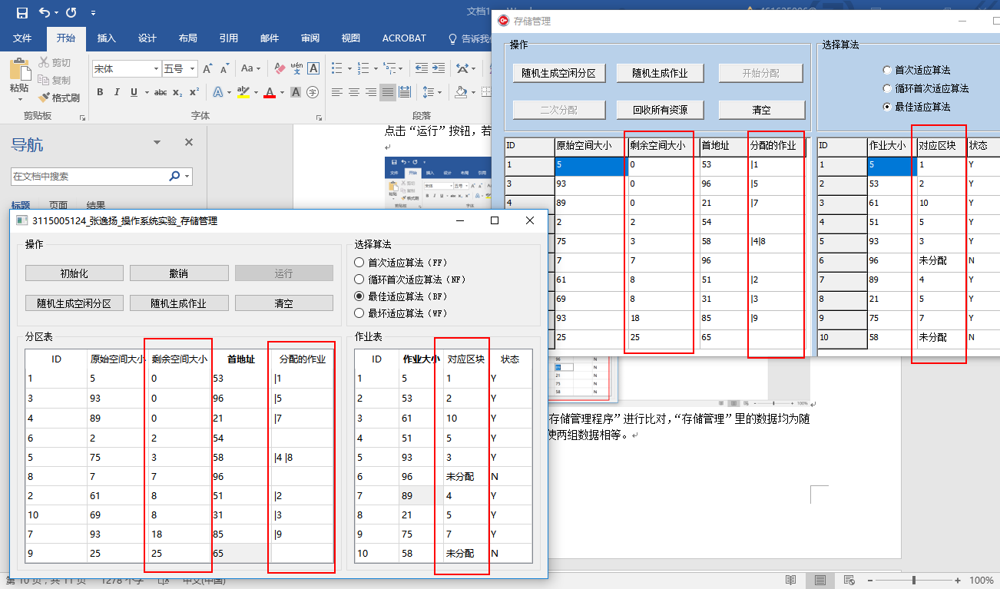

# OS_Exp_storage

「操作系统」实验三：存储管理

## 1 实验目的

通过编写和调试存储管理的模拟程序以加深对存储管理方案的理解。熟悉可变分区管理的各种适配算法。

## 2 实验内容

设计一个可变式分区分配的存储管理方案。并模拟实现分区的分配和回收过程。

对分区的管理法可以是下面四种算法：

（1）首次适应算法

（2）循环首次适应算法

（3）最佳适应算法

（4）最差适应算法

## 3 实验运行截图

▲程序主界面，由于此时表格中没有数据，仅可选择“初始化”或“清空”。

▲点击“初始化”按钮，随机生成 “分区表” 和 “作业表”。此时可选择“运行”按钮 运行。

选择“随机生成分区”按钮 单独随机生成分区表；选择“随机生成分区”按钮，单独随机生成作业表。

▲点击“运行”按钮，若此时没有选择任何算法，会提示“请选择算法”。

▲算法测试，此处选择与 范例——“存储管理” 进行比对，范例——“存储管理”里的数据均为随机生成。此处通过双击选择修改，使两组数据相等。

注意：范例——“存储管理”中的数据并不能自由修改。

▲首次适应算法 运行结果 比对。请注意：结果不一样。原因是 因为 范例——“存储管理”中 并没有把分区 按地址递增的次序链接。所以 范例——“存储管理” 中的答案是不正确的！

▲循环首次适应算法 运行结果 比对。请注意：结果不一样。原因同上。范例——“存储管理” 中的答案是不正确的！

▲最佳适应算法 运行结果 比对。结果相同，均是通过 升序排序 剩余空间大小 实现。

▲最坏适应算法 运行结果。此处由于 范例——“存储管理” 中并没有实现这种算法，所有没有比对参照。

## 4 关键代码

略。